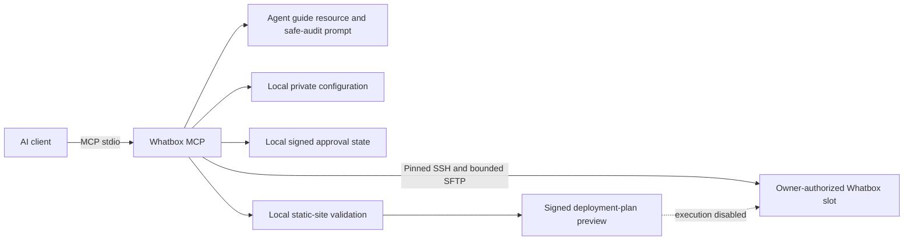

# Whatbox MCP

[](https://nodejs.org/)
[](https://modelcontextprotocol.io/)
[](LICENSE)

A security-first Model Context Protocol server that gives AI agents bounded,
structured access to an owner-authorized Whatbox slot.

Whatbox MCP can inspect storage, directories, supported services, torrent-client
process state, directory topology, configuration metadata, and website-hosting
readiness. It also validates local static-site sources and creates signed,
short-lived deployment-plan previews. Remote mutations are currently disabled.

The server runs locally over MCP stdio. Credentials remain outside the
repository and are never accepted as tool arguments.

> This is an independent project and is not affiliated with or endorsed by
> Whatbox.

## Why this project exists

AI agents are useful for operating infrastructure only when their authority is
clear and mechanically enforced. This server is designed around four rules:

1. prefer structured read-only observation;
2. expose narrow operations instead of a generic shell;
3. keep credentials and private configuration outside the model context;
4. require exact, short-lived external human approval before any future
   mutation.

## Current release

Version `0.8.0` includes:

- a local MCP stdio server for Node.js 20+;
- pinned SSH host verification and SSH-agent authentication;
- bounded, path-contained SFTP discovery;
- fixed read-only remote queries with bounded output;
- structured output schemas and readable titles for every tool;
- a consolidated agent-oriented operational snapshot;
- an MCP operations-guide resource and safe-audit prompt;
- HMAC-protected immutable mutation plans with expiry and one-time consumption;
- static-site source validation and signed deployment-plan previews;
- 34 credential-free tests, successful production build, and zero known npm
  audit vulnerabilities at the latest validation.

No remote upload, deployment activation, service start/stop/restart, deletion,
or permanent purge tool is enabled.

## Install

Read the complete [Installation Guide](docs/INSTALL.md).

Quick source installation:

```bash
git clone https://github.com/SNSEIxAUGMNTD/whatbox-mcp.git
cd whatbox-mcp
npm ci
npm run typecheck
npm test
npm run build
```

The project is not documented as npm-installable until an npm release is
actually published.

## Connect an AI client

### Codex CLI

```bash
codex mcp add whatbox -- node /absolute/path/to/whatbox-mcp/dist/index.js
codex mcp list
```

The ChatGPT desktop app, Codex CLI, and Codex IDE extension share MCP
configuration on the same Codex host. See the
[official OpenAI MCP documentation](https://developers.openai.com/codex/mcp/).

### Claude Code

```bash
claude mcp add --scope user whatbox -- node /absolute/path/to/whatbox-mcp/dist/index.js
claude mcp get whatbox
```

See the [official Claude Code MCP documentation](https://docs.anthropic.com/en/docs/claude-code/mcp).

### Generic stdio client

```json
{
  "mcpServers": {
    "whatbox": {
      "command": "node",
      "args": ["/absolute/path/to/whatbox-mcp/dist/index.js"]
    }
  }
}
```

Do not put Whatbox credentials in the MCP client configuration. The server
loads its private local file and checks its permissions.

## Agent-first interface

The preferred workflow for an AI agent is:

1. read `whatbox://guide/agent-operations`;
2. call `server_info` and `list_capabilities`;
3. call `whatbox_configuration_status`;
4. use `whatbox_operational_snapshot` for the consolidated assessment;
5. call focused read-only tools only when additional detail is required.

The server also provides the `whatbox_safe_audit` prompt with `full`,
`storage`, `services`, and `website` focus options.

All successful tool calls return both `structuredContent` and a serialized JSON
text block for compatibility. Declared output schemas help compatible clients
validate results before passing them to a model.

Read the [Agent Usage Guide](docs/AGENT_USAGE.md) for operating rules and tool
selection.

## Tools

| Tool | Display title | What it does |
| --- | --- | --- |
| `server_info` | Whatbox MCP Server Information | Returns non-sensitive server metadata and version. |
| `list_capabilities` | List Whatbox MCP Capabilities | Lists implemented tools, agent interfaces, safety rules, and critical next work. |
| `whatbox_configuration_status` | Check Local Whatbox Configuration | Reports configuration completeness without returning values. |
| `whatbox_connection_status` | Check Whatbox SSH Connection | Tests pinned SSH connectivity and returns only safe diagnostics. |
| `whatbox_operational_snapshot` | Get Consolidated Whatbox Operational Snapshot | Combines storage pressure, service metadata, website readiness, recommendations, and explicit mutation state. |
| `whatbox_storage_status` | Inspect Whatbox Storage Capacity | Returns capacity by root index without exposing configured remote paths. |
| `whatbox_list_directory` | List an Allowed Whatbox Directory | Lists bounded entries below an allowed root; rejects absolute paths and escapes. |
| `whatbox_structure_map` | Map an Allowed Whatbox Directory | Produces a bounded directory-only map and Mermaid diagram without file-content reads. |
| `whatbox_torrent_clients_status` | Inspect Supported Torrent Clients | Reports running state for rTorrent, Deluge, Transmission, and qBittorrent only. |
| `whatbox_services_status` | Inspect Allowlisted Whatbox Services | Reports known configuration-location and process state without arguments or configuration contents. |
| `whatbox_configuration_review` | Review Whatbox Configuration Metadata | Produces conservative findings with confidence, observations, and recommendations. |
| `whatbox_website_readiness` | Check Website Hosting Readiness | Checks fixed Nginx, configuration-existence, process, candidate-root, and storage facts. |
| `whatbox_website_deployment_plan` | Plan a Static Website Deployment | Validates an allowlisted local source and creates a redacted signed preview; execution remains disabled. |

All tools are currently annotated read-only.

## What agents can ask

Examples:

- “Perform a full safe audit of my Whatbox slot.”
- “Is storage pressure becoming a problem?”
- “Which supported services appear configured or running?”
- “Map the top two levels of allowed root 0.”
- “Assess whether the slot is ready for userland Nginx hosting.”
- “Validate this allowlisted static-site source and show the deployment plan.”

The agent should always separate observed facts from recommendations and should
never describe a running process as healthy without a health check.

## Architecture



The MCP cannot access provider billing, another customer's files, root-only
operations, Manage Apps, or managed links through SSH. DNS, domains, and
provider-account actions remain explicit external steps unless a separate
authorized integration is added.

## Security model

- No generic remote shell tool.
- No caller-supplied command strings.
- No credentials in tool arguments or results.
- Private configuration must be mode `0600`.
- SSH host identity is pinned by SHA-256 fingerprint.
- SSH-agent authentication is recommended.
- Remote paths are restricted to configured non-root allowlists.
- Canonical path checks deny traversal and symlink escapes.
- Fixed remote queries have bounded output.
- Sensitive directories and credential-like local source names are denied.
- Storage results omit configured remote root paths.
- Process state is collected from allowlisted command names without arguments.
- Tool annotations are hints, never authorization.

See [Security Policy](SECURITY.md) and
[Architecture and Product Scope](docs/ARCHITECTURE.md).

## Mutation and approval model

The codebase contains the foundation for future mutations but does not expose a
mutation tool.

A future mutation must:

1. create an immutable plan before execution;
2. bind the exact slot, action, and canonical targets;
3. expire within a short fixed window;
4. use negotiated MCP `input_required` interaction with signed request state;
5. validate explicit accepted human input;
6. consume approval atomically at most once;
7. revalidate path containment and target identity;
8. provide validation, health checking, rollback, and redacted audit logging.

Deletion has stronger rules: initial removal means quarantine, and permanent
purge requires a separate second approval. A boolean or confirmation phrase
supplied by a model is never sufficient.

## Local configuration

Private values live at:

```text
~/.config/whatbox-mcp/local.env
```

The directory must be mode `0700` and the file mode `0600`. Copy variable names
from `.env.example`; never commit or share real values.

After local setup, use sanitized checks:

```bash
npm run check:config
npm run check:connection
npm run check:storage
npm run check:directory
npm run check:torrent-clients
npm run check:structure
npm run check:services
npm run check:review
npm run check:website
npm run check:snapshot
```

Share only the emitted JSON, never private files or raw SSH debugging output.

## Development

```bash
npm ci
npm run typecheck
npm test
npm run build
npm audit
npm pack --dry-run
```

Run the server from source:

```bash
npm run dev
```

Run the production build:

```bash
npm start
```

MCP protocol messages use standard input/output. Diagnostics must use standard
error so they do not corrupt the protocol stream.

## Roadmap

Highest priority:

1. fixed SFTP release staging and remote manifest validation;
2. signed `input_required` approval handshake and denial-path coverage;
3. atomic static-site activation, fixed Nginx validation, bounded health checks,
   rollback, and redacted audit logging;
4. live staging and rollback validation before any deployment write is enabled.

Later:

- read-only torrent summaries through separately configured supported client
  APIs;
- redacted recent-error and real service-health adapters;
- approval-gated service lifecycle actions;
- multiple separately authorized Whatbox profiles;
- optional authorized provider integration for Manage Apps and managed links;
- a separately threat-modeled remote transport.

PHP deployment is intentionally deferred until static deployment and rollback
are live-validated.

## Documentation

| Document | Purpose |
| --- | --- |
| [Installation Guide](docs/INSTALL.md) | Installation, client setup, updates, removal, and troubleshooting |
| [Agent Usage Guide](docs/AGENT_USAGE.md) | Agent workflow, tool selection, and model safety rules |
| [Local Configuration](docs/LOCAL_CONFIGURATION.md) | Private local configuration and sanitized checks |
| [Architecture](docs/ARCHITECTURE.md) | Product scope, authority boundaries, deployment, and approval design |
| [Security Policy](SECURITY.md) | Secret handling, operation policy, and vulnerability reporting |
| [Coding-agent Handoff](docs/CODEX_CLI_HANDOFF.md) | Current implementation status and next engineering checkpoint |

## Contributing and reporting issues

Issues and pull requests are welcome after the initial public repository is
established. Never include real credentials, hostnames, usernames, private
paths, raw SSH output, cookies, tokens, or approval state in an issue.

Report suspected security vulnerabilities privately as described in
[SECURITY.md](SECURITY.md).

## License

[MIT](LICENSE)
