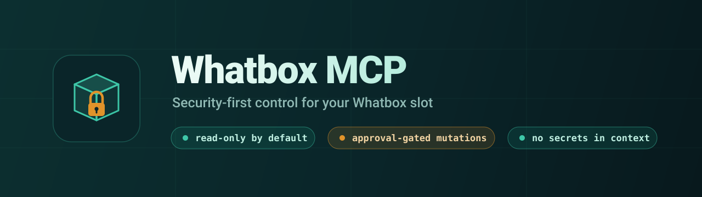
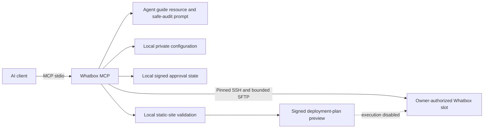

<p align="center">
  
</p>

# Whatbox MCP

[](https://nodejs.org/)
[](https://modelcontextprotocol.io/)
[](package.json)
[](src)
[](LICENSE)

A security-first Model Context Protocol server that gives AI agents bounded,
structured access to an owner-authorized Whatbox slot.

Whatbox MCP can inspect storage, directories, supported services, torrent-client
process state, directory topology, configuration metadata, website-hosting
readiness, and bounded userland Nginx diagnostics. It also validates local
static-site sources and creates signed, short-lived deployment-plan previews.

As of `0.14.0` it can additionally perform **approval-gated mutations** —
upload, download, move, mkdir, quarantine-based delete and second-approval
purge, configuration backup, service start/stop/restart, atomic website
deployment with rollback, and torrent add/control/remove over an SSH loopback
tunnel. Mutations are **disabled by default** and every destructive action
requires explicit human approval through the MCP protocol, even when an agent
runs unattended.

The server runs locally over MCP stdio. Credentials remain outside the
repository and are never accepted as tool arguments.

> This is an independent project and is not affiliated with or endorsed by
> Whatbox.

## Why this project exists

AI agents are useful for operating infrastructure only when their authority is
clear and mechanically enforced. This server is designed around four rules:

1. prefer structured read-only observation;
2. expose narrow operations instead of a generic shell;
3. keep credentials and private configuration outside the model context;
4. require exact, short-lived external human approval before any future
   mutation.

## Current release

Version `0.14.0` includes everything from the read-only line —

- a local MCP stdio server for Node.js 20+;
- pinned SSH host verification and SSH-agent authentication;
- bounded, path-contained SFTP discovery;
- fixed read-only remote queries with bounded output;
- structured output schemas and readable titles for every tool;
- a consolidated agent-oriented operational snapshot;
- MCP operations-guide and tools-catalog resources and a safe-audit prompt;
- fixed Nginx syntax testing, an optional body-free loopback probe, and
  content-free recent-error severity counts;
- static-site source validation and signed deployment-plan previews;

— plus **approval-gated mutations**:

- a master `WHATBOX_MUTATIONS_ENABLED` kill-switch (off by default);
- HMAC-signed immutable plans carried as MCP `requestState`, with expiry,
  exact-target binding, and one-time consumption;
- destructive actions gated behind MCP elicitation (human approval), with a
  redacted local audit log of every planned, approved, denied, and executed step;
- file upload / download / move / mkdir with no-overwrite and free-space checks;
- quarantine-based delete and a separate second-approval permanent purge;
- allowlisted service configuration backup;
- fixed service start/stop/restart using the documented userland recipes;
- atomic static-site deployment with remote checksum verification, health check,
  and rollback;
- torrent add / pause / resume / label / ratio / remove over an SSH loopback
  tunnel to Transmission or qBittorrent;
- a credential-free test suite (53 tests), successful production build, and zero
  known npm audit vulnerabilities at the latest validation.

## Install

Read the complete [Installation Guide](docs/INSTALL.md).

Quick source installation:

```bash
git clone https://github.com/SNSEIxAUGMNTD/whatbox-mcp.git
cd whatbox-mcp
npm ci
npm run typecheck
npm test
npm run build
```

The project is not documented as npm-installable until an npm release is
actually published.

## Connect an AI client

### Codex CLI

```bash
codex mcp add whatbox -- node /absolute/path/to/whatbox-mcp/dist/index.js
codex mcp get whatbox
```

Registration is a one-time setup. Codex launches the registered `stdio`
server automatically; do not keep `npm start` running in another terminal.
See the [Startup Guide](docs/STARTUP.md) for the exact macOS reboot, SSH-agent,
and daily launch sequence.

The ChatGPT desktop app, Codex CLI, and Codex IDE extension share MCP
configuration on the same Codex host. See the
[official OpenAI MCP documentation](https://developers.openai.com/codex/mcp/).

### Claude Code

```bash
claude mcp add --scope user whatbox -- node /absolute/path/to/whatbox-mcp/dist/index.js
claude mcp get whatbox
```

See the [official Claude Code MCP documentation](https://docs.anthropic.com/en/docs/claude-code/mcp).

### Generic stdio client

```json
{
  "mcpServers": {
    "whatbox": {
      "command": "node",
      "args": ["/absolute/path/to/whatbox-mcp/dist/index.js"]
    }
  }
}
```

Do not put Whatbox credentials in the MCP client configuration. The server
loads its private local file and checks its permissions.

## Agent-first interface

The preferred workflow for an AI agent is:

1. read `whatbox://guide/agent-operations`;
2. call `server_info` and `list_capabilities`;
3. call `whatbox_configuration_status`;
4. use `whatbox_operational_snapshot` for the consolidated assessment;
5. call focused read-only tools only when additional detail is required.

The server also provides the `whatbox_safe_audit` prompt with `full`,
`storage`, `services`, and `website` focus options.

All successful tool calls return both `structuredContent` and a serialized JSON
text block for compatibility. Declared output schemas help compatible clients
validate results before passing them to a model.

Read the [Agent Usage Guide](docs/AGENT_USAGE.md) for operating rules and tool
selection.

## Tools

| Tool | Display title | What it does |
| --- | --- | --- |
| `server_info` | Whatbox MCP Server Information | Returns non-sensitive server metadata and version. |
| `list_capabilities` | List Whatbox MCP Capabilities | Lists implemented tools, agent interfaces, safety rules, and critical next work. |
| `whatbox_configuration_status` | Check Local Whatbox Configuration | Reports configuration completeness without returning values. |
| `whatbox_connection_status` | Check Whatbox SSH Connection | Tests pinned SSH connectivity and returns only safe diagnostics. |
| `whatbox_operational_snapshot` | Get Consolidated Whatbox Operational Snapshot | Combines storage pressure, service metadata, website readiness, recommendations, and explicit mutation state. |
| `whatbox_storage_status` | Inspect Whatbox Storage Capacity | Returns shared-filesystem capacity by root index (labeled `shared_filesystem`) without exposing configured remote paths. |
| `whatbox_account_quota` | Inspect Whatbox Account Quota | Reports the account's own disk usage against its plan (`quota`, with a courteous `nice`/`ionice` `du` fallback), separate from the shared array. |
| `whatbox_directory_usage` | Break Down Disk Usage by Directory | Per-subdirectory byte sizes (largest first) plus the total — what is using the quota. |
| `whatbox_orphaned_data` | Find Orphaned Data | Top-level entries no loaded torrent references (rTorrent), with sizes — reclaimable quota. |
| `whatbox_app_catalog` | List Installable App Templates | Lists the curated, SHA-256-pinned app templates, whether each is installed, and (for service apps) whether it is running. |
| `whatbox_list_directory` | List an Allowed Whatbox Directory | Lists bounded entries below an allowed root; rejects absolute paths and escapes. |
| `whatbox_structure_map` | Map an Allowed Whatbox Directory | Produces a bounded directory-only map and Mermaid diagram without file-content reads. |
| `whatbox_torrent_clients_status` | Inspect Supported Torrent Clients | Reports running state for rTorrent, Deluge, Transmission, and qBittorrent only. |
| `whatbox_services_status` | Inspect Allowlisted Whatbox Services | Reports known configuration-location and process state without arguments or configuration contents. |
| `whatbox_configuration_review` | Review Whatbox Configuration Metadata | Produces conservative findings with confidence, observations, and recommendations. |
| `whatbox_website_readiness` | Check Website Hosting Readiness | Checks fixed Nginx, configuration-existence, process, candidate-root, and storage facts. |
| `whatbox_website_diagnostics` | Diagnose Userland Nginx Safely | Tests fixed Nginx syntax, optionally probes a loopback port without a response body, and returns recent error-severity counts without log lines. |
| `whatbox_website_deployment_plan` | Plan a Static Website Deployment | Validates an allowlisted local source and creates a redacted signed preview. |
| `whatbox_list_tools` | List Whatbox MCP Tools and Processes | Returns the full catalog by category and risk plus the current mutation state (backs `/tools`). |

### Mutation tools (require `WHATBOX_MUTATIONS_ENABLED=true`)

| Tool | Risk | What it does |
| --- | --- | --- |
| `whatbox_upload_path` | reversible | Uploads an allowlisted local path; never overwrites; checks remote space. |
| `whatbox_download_path` | reversible | Downloads a remote path into the local download directory; skips symlinks. |
| `whatbox_move_path` | reversible | Moves/renames within allowed roots; never overwrites. |
| `whatbox_make_directory` | reversible | Creates a directory and missing parents. |
| `whatbox_backup_configuration` | reversible | Backs up allowlisted service config to a timestamped local archive. |
| `whatbox_service_control` | reversible / destructive | Starts (reversible) or stops/restarts (approval) an allowlisted service. |
| `whatbox_website_deploy_execute` | reversible | Stages, checksum-verifies, atomically activates, and health-checks a release. |
| `whatbox_website_rollback` | destructive | Repoints to a prior release (approval). |
| `whatbox_run_command` | destructive | Runs one composed shell command with exact-text human approval, a destructive-shape denylist, bounded output, and a timeout. Requires `WHATBOX_SHELL_ENABLED=true`. |
| `whatbox_app_install` | destructive | Installs a curated app from a SHA-256-pinned manifest: verify checksum, never overwrite, register (screen + cron). Approval required; exact script audit-logged. |
| `whatbox_app_uninstall` | destructive | Stops, de-crons, and quarantines a template-installed app (reversible). Approval required. |
| `whatbox_app_restart` | destructive | Kills and relaunches a template-installed service app. Approval required. |
| `whatbox_torrent_add` | reversible | Adds a magnet/HTTP(S) torrent. |
| `whatbox_torrent_control` | reversible | Pauses/resumes/reannounces/labels/ratio-limits one torrent. |
| `whatbox_quarantine_path` | destructive | Soft-deletes a path into dated quarantine (approval). |
| `whatbox_purge_quarantine` | destructive | Permanently deletes a quarantined item (second approval). |
| `whatbox_torrent_remove` | destructive | Removes a torrent, optionally its data (approval). |
| `whatbox_list_quarantine` | read-only | Lists quarantined items awaiting restore or purge. |

Read-only tools are annotated read-only; mutation tools are annotated
non-read-only, and destructive tools carry the destructive hint. Annotations are
hints, never authorization.

## What agents can ask

Examples:

- “Perform a full safe audit of my Whatbox slot.”
- “Is storage pressure becoming a problem?”
- “Which supported services appear configured or running?”
- “Map the top two levels of allowed root 0.”
- “Assess whether the slot is ready for userland Nginx hosting.”
- “Test Nginx syntax and the configured loopback endpoint without returning logs or response content.”
- “Validate this allowlisted static-site source and show the deployment plan.”

The agent should always separate observed facts from recommendations and should
never describe a running process as healthy without a health check.

## Architecture



The MCP cannot access provider billing, another customer's files, root-only
operations, Manage Apps, or managed links through SSH. DNS, domains, and
provider-account actions remain explicit external steps unless a separate
authorized integration is added.

## Security model

- No generic remote shell tool.
- No caller-supplied command strings.
- No credentials in tool arguments or results.
- Private configuration must be mode `0600`.
- SSH host identity is pinned by SHA-256 fingerprint.
- SSH-agent authentication is recommended.
- Remote paths are restricted to configured non-root allowlists.
- Canonical path checks deny traversal and symlink escapes.
- Fixed remote queries have bounded output.
- Sensitive directories and credential-like local source names are denied.
- Storage results omit configured remote root paths.
- Process state is collected from allowlisted command names without arguments.
- Website diagnostics use fixed `/usr/sbin/nginx` and `/usr/bin/curl` probes;
  configuration text, HTTP bodies, and log lines are never returned.
- Tool annotations are hints, never authorization.

See [Security Policy](SECURITY.md) and
[Architecture and Product Scope](docs/ARCHITECTURE.md).

## Mutation and approval model

Mutations are **off by default**. Set `WHATBOX_MUTATIONS_ENABLED=true` in the
private local configuration to enable the mutation tools; without it every
mutation tool returns a `mutations_disabled` denial.

Every mutation:

1. creates an immutable HMAC-signed plan before execution;
2. binds the exact slot, action, and canonical target digests;
3. expires within a short fixed window (5 minutes; 10-minute hard maximum);
4. is recorded in a redacted local audit log.

**Reversible** actions (upload, download, move, mkdir, backup, service start,
website deploy, torrent add/control) run once the plan is created.

**Destructive** actions (quarantine, purge, service stop/restart, website
rollback, torrent remove) additionally require negotiated MCP elicitation:
round one returns `input_required` carrying the sealed plan as signed
`requestState`; the retry must carry an accepted human elicitation response and
the untampered plan, whose action, slot, and exact targets are revalidated
before one-time consumption. A boolean or confirmation phrase supplied by a
model is never sufficient — approval comes from the client's own confirmation UI.

Deletion has stronger rules: initial removal means quarantine (data is moved,
not erased, so it is reversible and space-neutral), and permanent purge requires
a separate second approval. Uploads, moves, and mkdir never overwrite; remote
and local free space are checked before every transfer and deployment.

## Local configuration

Private values live at:

```text
~/.config/whatbox-mcp/local.env
```

The directory must be mode `0700` and the file mode `0600`. Copy variable names
from `.env.example`; never commit or share real values.

After local setup, use sanitized checks:

```bash
npm run check:config
npm run check:connection
npm run check:storage
npm run check:directory
npm run check:torrent-clients
npm run check:structure
npm run check:services
npm run check:review
npm run check:website
npm run check:website-diagnostics
npm run check:snapshot
```

Share only the emitted JSON, never private files or raw SSH debugging output.

## Development

```bash
npm ci
npm run typecheck
npm test
npm run build
npm audit
npm pack --dry-run
```

Run the server from source:

```bash
npm run dev
```

Run the production build:

```bash
npm start
```

These manual commands are for development and protocol debugging. They wait
silently for an MCP client over standard input/output and are not needed for
normal Codex use. Diagnostics must use standard error so they do not corrupt
the protocol stream.

## Roadmap

Shipped in `0.10.0`: SFTP release staging with remote checksum validation, the
signed `input_required` approval handshake with denial-path coverage, atomic
static-site activation with health check and rollback, redacted audit logging,
approval-gated service lifecycle actions, and torrent management through a
loopback RPC tunnel.

Next:

- service-specific health adapters beyond userland Nginx;
- multiple separately authorized Whatbox connection profiles;
- optional authorized provider integration for Manage Apps and managed links;
- a separately threat-modeled remote transport.

PHP application deployment is intentionally deferred until the static
deployment and rollback path has been broadly live-validated.

## Documentation

| Document | Purpose |
| --- | --- |
| [Getting Started](docs/GETTING_STARTED.md) | Bullet-point walkthrough, install first |
| [Hotsheet](docs/HOTSHEET.md) | One-screen command, tool, and process reference |
| [Installation Guide](docs/INSTALL.md) | Installation, client setup, updates, removal, and troubleshooting |
| [Startup Guide](docs/STARTUP.md) | One-time registration, reboot startup, SSH-agent loading, and daily launch commands |
| [Agent Usage Guide](docs/AGENT_USAGE.md) | Agent workflow, tool selection, and model safety rules |
| [Local Configuration](docs/LOCAL_CONFIGURATION.md) | Private local configuration and sanitized checks |
| [Architecture](docs/ARCHITECTURE.md) | Product scope, authority boundaries, deployment, and approval design |
| [Security Policy](SECURITY.md) | Secret handling, operation policy, and vulnerability reporting |
| [Coding-agent Handoff](docs/CODEX_CLI_HANDOFF.md) | Current implementation status and next engineering checkpoint |

## Contributing and reporting issues

Issues and pull requests are welcome after the initial public repository is
established. Never include real credentials, hostnames, usernames, private
paths, raw SSH output, cookies, tokens, or approval state in an issue.

Report suspected security vulnerabilities privately as described in
[SECURITY.md](SECURITY.md).

## License

[MIT](LICENSE)
